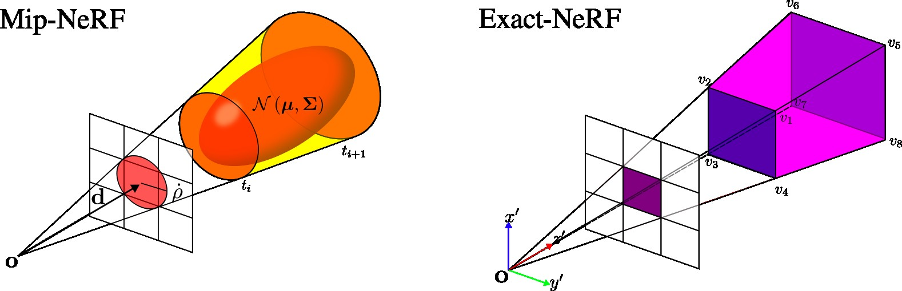

# Exact-NeRF

This repository contains the code release of [Exact-NeRF: An Exploration of a Precise Volumetric Parameterization for Neural Radiance Fields
](https://kostadinovshalon.github.io/exact-nerf/), 
accepted at [CVPR 2023](https://cvpr2023.thecvf.com/). This is a fork of [MultiNeRF](https://github.com/google-research/multinerf),
having the same usage instructions.



## Setup
Please refer to the setup instructions of [MultiNeRF](https://github.com/google-research/multinerf)
for setup

**Important**: this repository runs with JAX 0.3.15.

## Config
Example config files for Exact-NeRF on the blender and mip-NeRF 360 datasets can be found in
`configs/blender_256_exact.gin` and `configs/360_exact.gin`. The main difference with the
original config files is the addition of `Config.pyramid = True` and the use of
`ExactPropMLP` and `ExactNerfMLP` instead of `PropMLP` and `NerfMLP`.

## General details
The remaining general details concering on running, the datasets or custom implementations remains
unchanged with respect to [MultiNeRF](https://github.com/google-research/multinerf). Refer
to the original repository for these details.

## Citation
If you use the implementation or the ideas of Exact-NeRF, cite it as:

```
@article{isaac-medina2023exactnerf,
      title={{Exact-NeRF}: An Exploration of a Precise Volumetric Parameterization for Neural Radiance Fields},
      author={Brian K. S. Isaac-Medina and Chris G. Willcocks and Toby P. Breckon},
      year={2023},
      journal={CVPR}
}
```
